<h1 align="center">Hi 👋, I'm <a href="https://ryokusnadi.vercel.app/" target="_blank">Ryo Kusnadi</a></h1>

  

  
  
  

<table>
<tr>
<td valign="top" width="60%">

- 🔭 I'm currently a Backend Engineer building AI-powered developer tools
- 📝 I regularly write articles on [Level Up Coding](https://levelup.gitconnected.com)
- 💬 Ask me about **Go & Python**
- 📫 How to reach me **ryokusnadi@gmail.com**
- 📄 Know about my experience: <a href="https://ryokusnadi.vercel.app/Resume.pdf" target="_blank">Resume</a>

</td>
<td width="40%">
  
</td>
</tr>
</table>

 

<h3 align="center"><strong>Tech Stack</strong></h3>

  

 

<h3 align="center"><strong>Recent Posts</strong></h3>

- [Structured Logging In Go 1.21](https://levelup.gitconnected.com/structured-logging-in-go-1-21-b6713265787)
- [Deep Dive To 'Request — Response'](https://levelup.gitconnected.com/deep-dive-to-request-response-91404b5af0e8)
- [Introduction to Kafka In Go](https://levelup.gitconnected.com/introduction-to-kafka-in-go-2a5755df504c)

 

<h3 align="center"><strong>Open Source Contribution</strong></h3>
<!-- OSS-CONTRIBUTIONS:START -->
<table align="center">
  <thead align="center">
    <tr>
      <td><b>🎁 Projects</b></td>
      <td><b>⭐ Stars</b></td>
      <td><b>📚 Forks</b></td>
      <td><b>🛎 Issues</b></td>
      <td><b>📬 Pull requests</b></td>
      <td><b>🔀 My PRs</b></td>
      <td><b>💼 Role</b></td>
    </tr>
  </thead>
  <tbody>
    <tr>
      <td><a href="https://github.com/labstack/echo"><b>echo</b></a></td>
      <td></td>
      <td></td>
      <td></td>
      <td></td>
      <td><a href="https://github.com/labstack/echo/pull/2461">#2461</a></td>
      <td></td>
    </tr>
    <tr>
      <td><a href="https://github.com/modelcontextprotocol/go-sdk"><b>go-sdk</b></a></td>
      <td></td>
      <td></td>
      <td></td>
      <td></td>
      <td><a href="https://github.com/modelcontextprotocol/go-sdk/pull/563">#563</a></td>
      <td></td>
    </tr>
    <tr>
      <td><a href="https://github.com/daixiang0/gci"><b>gci</b></a></td>
      <td></td>
      <td></td>
      <td></td>
      <td></td>
      <td><a href="https://github.com/daixiang0/gci/pull/178">#178</a></td>
      <td></td>
    </tr>
  </tbody>
</table>
<!-- OSS-CONTRIBUTIONS:END -->

 

<h3 align="center"><strong>🏆 GitHub Achievements</strong></h3>

  

 

<h3 align="center">Connect With Me</h3>

  
  
  

